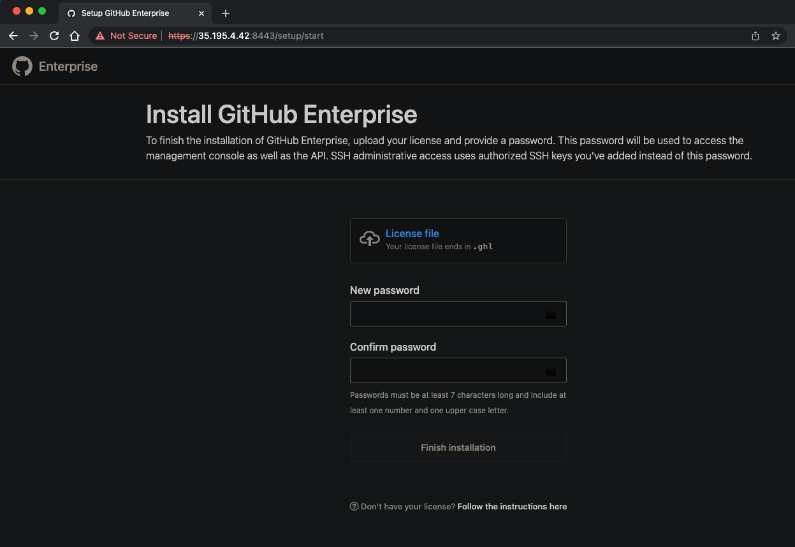
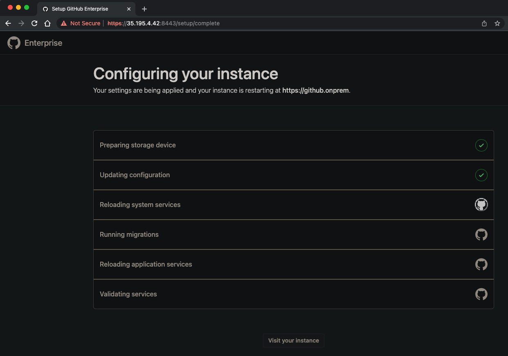
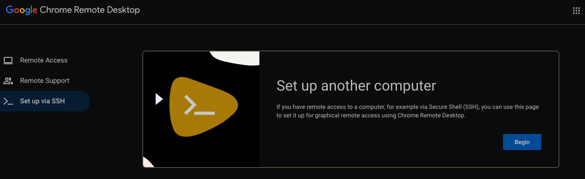
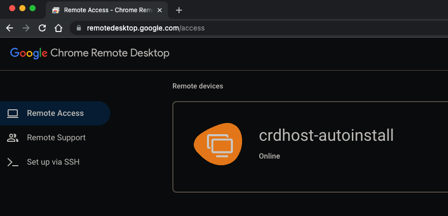
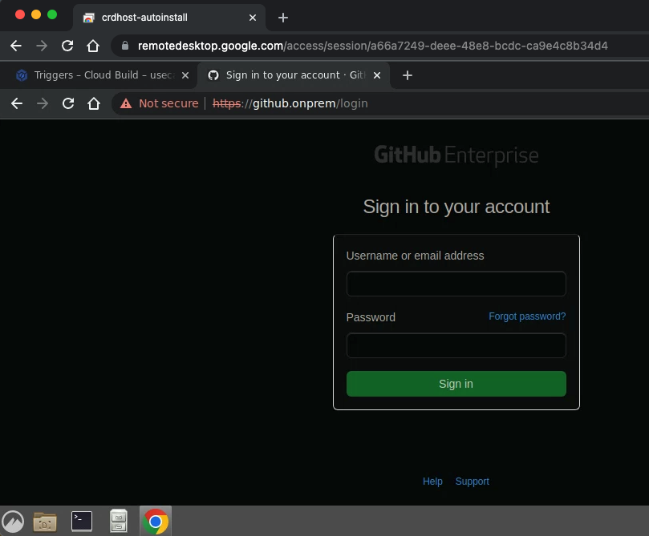
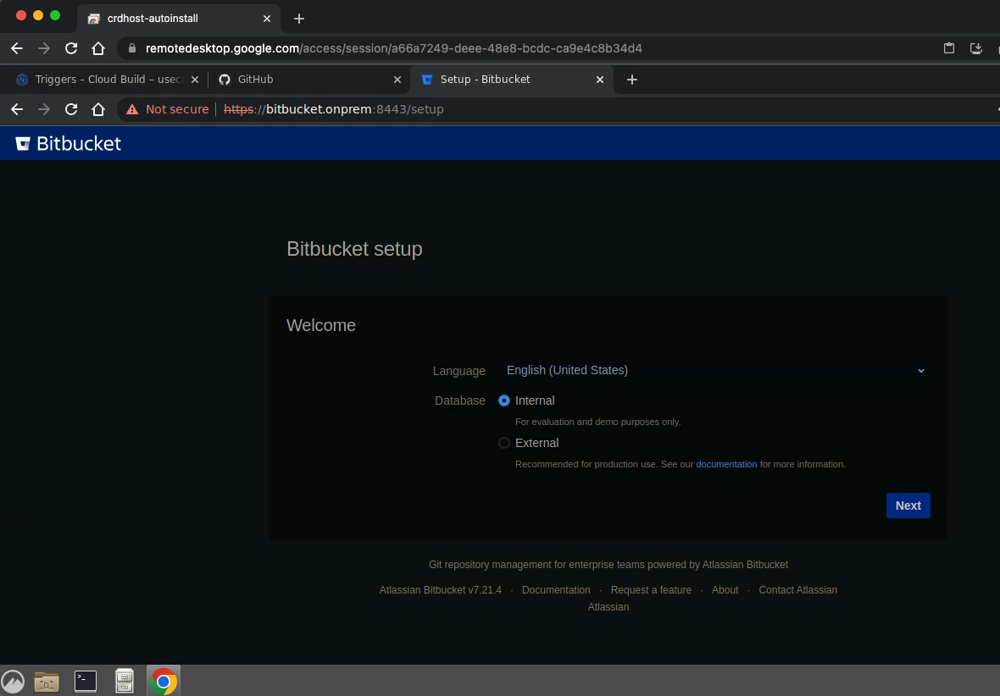

# terraform-gcp-github-enterprise-bitbucket

A terraform module to provision Github Enterprise and Bitbucket server on GCP VM 
dedicated to serve as private in-house source version control system which can be [integrated with GCP Cloud Build](https://cloud.google.com/build/docs/automating-builds/github/connect-host-github-enterprise?generation=2nd-gen)

### Prerequisites

* A normal GCP Project to serve as on-premise environment to host github enterprise instances, bitbucket instance and chrome remote desktop instance
* A normal VPC network and subnet setup in the onprem project
* A GCP [vpc host Project](https://cloud.google.com/vpc/docs/shared-vpc) to serve as shared VPC
* A shared vpc and subnet setup in the vpc host project

### Terraform Provision

* Prepare a backend.tf following sample file [backend.tf.sample](backend.tf.sample)
* Prepare a terraform.tfvars following sample file [terraform.tfvars.sample](terraform.tfvars.sample)
* Run terraform apply

### Install GitHub Enterprise

* On a Chrome browser, go to address https://[github GCP VM External IP] 
* Prepare a github enterprise [trial license](https://docs.github.com/en/enterprise-server@3.6/get-started/signing-up-for-github/setting-up-a-trial-of-github-enterprise-server#setting-up-your-trial-of-github-enterprise-server)



* Follow installation instructions on the page then wait for github initialization, it might take up to 1 hour



### Config Chrome Remote Desktop

* Follow [instructions](https://cloud.google.com/architecture/chrome-desktop-remote-on-compute-engine#configure_and_start_the_chrome_remote_desktop_service) to setup a Chrome Remote Desktop so that we can access github enterprise instance via private DNS domain https://github.onprem



* run `gcloud compute ssh` log into remote desktop VM, then start remote desktop service

```shell
$ gcloud compute instances list
NAME                 ZONE            MACHINE_TYPE   PREEMPTIBLE  INTERNAL_IP  EXTERNAL_IP     STATUS
bitbucket-server     europe-west1-b  n1-standard-1               172.16.64.3  [Internet IP]    RUNNING
crdhost-autoinstall  europe-west1-b  n1-standard-1               172.16.64.2  [Internet IP]    RUNNING
github-enterprise    europe-west1-b  n1-standard-8               172.16.64.4  [Internet IP]    RUNNING

$ gcloud compute ssh crdhost-autoinstall --zone europe-west1-b --tunnel-through-iap
Linux crdhost-autoinstall 5.10.0-19-cloud-amd64 #1 SMP Debian 5.10.149-2 (2022-10-21) x86_64

The programs included with the Debian GNU/Linux system are free software;
the exact distribution terms for each program are described in the
individual files in /usr/share/doc/*/copyright.

Debian GNU/Linux comes with ABSOLUTELY NO WARRANTY, to the extent
permitted by applicable law.

junxingmo@crdhost-autoinstall:~$
junxingmo@crdhost-autoinstall:~$ DISPLAY= /opt/google/chrome-remote-desktop/start-host --code="4/0AWtgzh6jQm2ScdpcsKjGwhWKCyyMkF8v1CduzLek9Uh8qYiDe1f-Psh6wm9kufKQXNEC0Q" --redirect-url="https://remotedesktop.google.com/_/oauthredirect" --name=$(hostname)
Enter a PIN of at least six digits:
Enter the same PIN again:
[0131/081125.227392:INFO:daemon_controller_delegate_linux.cc(98)] Created symlink /etc/systemd/system/multi-user.target.wants/chrome-remote-desktop@junxingmo.service → /lib/systemd/system/chrome-remote-desktop@.service.
junxingmo@crdhost-autoinstall:~$

```

* access Chrome Remote Desktop on browser 



* On Chrome Remote Desktop session, start a browser to access github instance via private DNS domain https://github.onprem
  


### Bitbucket 

* run `gcloud compute ssh` log into bitbucket VM, continue bitbucket setup using [bitbucket-server-setup-script.sh](bitbucket-server-setup-script.sh)
  
```shell
$ gcloud compute instances list
NAME                 ZONE            MACHINE_TYPE   PREEMPTIBLE  INTERNAL_IP  EXTERNAL_IP     STATUS
bitbucket-server     europe-west1-b  n1-standard-1               172.16.64.3  [Internet IP]   RUNNING
crdhost-autoinstall  europe-west1-b  n1-standard-1               172.16.64.2  [Internet IP]   RUNNING
github-enterprise    europe-west1-b  n1-standard-8               172.16.64.4  [Internet IP]   RUNNING

$ gcloud compute ssh bitbucket-server --zone europe-west1-b --tunnel-through-iap
[junxingmo@bitbucket-server ~]$
[junxingmo@bitbucket-server ~]$ sudo su -l root
[root@bitbucket-server ~]#
```

* On bitbucket VM ssh session, paste content of [bitbucket-server-setup-script.sh](bitbucket-server-setup-script.sh) on ssh session, then run the snippet of source code on ssh session 
```shell
[root@bitbucket-server ~]# if [[ "These need to be run as root account on VM manually after initial setup" == "YES" ]]; then
>     create_bitbucket_systemd_service
>     generate_bitbucket_cert
>     set_bitbucket_properties
>     restart_bitbucket
> fi
[root@bitbucket-server ~]#
```

* On Chrome Remote Desktop session, start a browser to access bitbucket instance via private DNS domain https://bitbucket.onprem:8443




